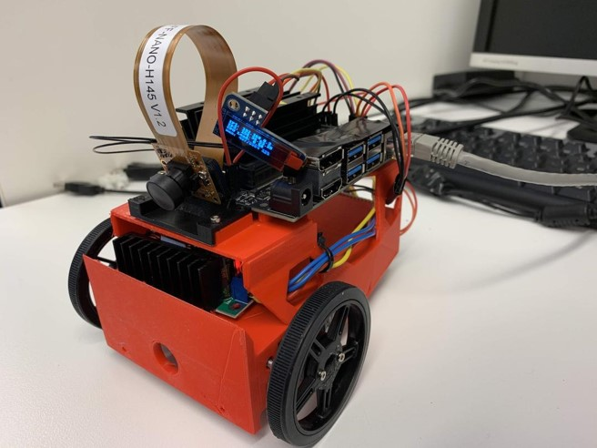

.. MAS507 documentation master file, created by
   sphinx-quickstart on Tue Aug 25 21:04:02 2020.
   You can adapt this file completely to your liking, but it should at least
   contain the root `toctree` directive.

|

.. raw:: html

   <h2 style="text-align: center">University of Agder</h2>
   
Department of Engineering Sciences Grimstad, Norway

   
|

|
|

MAS507 - Product Development and Project Management
===================================================

Student Group
-------------

- Student A

- Student B

- Student C

Lecturers
---------

- Sondre Sanden Tørdal, PhD
   - Postdoctoral Fellow in Mehcatronics
   - https://www.uia.no/kk/profil/sondrest

- Mette Mo Jakobsen, PhD
   - Professor in Product Development and Project-based learning
   - https://www.uia.no/kk/profil/mettemj

.. toctree::
   :maxdepth: 2
   :caption: Contents:

   src/start
   src/report
   src/ros
   src/calibration
   src/web-controller
   src/git
   src/strawberry
   src/demos
   src/troubleshooting
   src/bibliography

.. Indices and tables
.. ==================

.. * :ref:`genindex`
.. * :ref:`modindex`
.. * :ref:`search`
