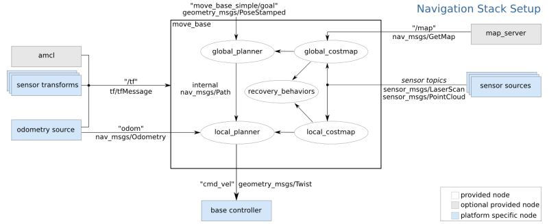

Navigation Stack
================ 

This inspired by :

- http://wiki.ros.org/navigation/Tutorials/RobotSetup

- https://hagenmek.gitlab.io/mas514/src/start.html

- https://automaticaddison.com/how-to-set-up-the-ros-navigation-stack-on-a-robot/

As start we assumed that you have mas514 package in your catkin work space if not please refer to the following link :https://hagenmek.gitlab.io/mas514/src/start.html.

The ROS Navigation Stack is a collection of software packages that you can use to help your robot move from a **starting location to a goal location** safely.
In order to build the Navigation stack you have to build and set up several packages, as in the figure bellow, The white components are required components that are already implemented in Ros, the gray components are optional components that are already implemented, and the blue components must be created for each robot platform. 

    Navigation Stack

Now, let us build the navigation stack for Jetbot step by step. 

- First, open your Jetbot terminal  and navigate to your workspace create the first package for navigation, for me it’s called jetbot_nav, then build it

.. code-block::

    cd ~/catkin_ws/src
    catkin_create_pkg jetbot_nav rospy roscpp std_msgs tf tf2_ros geometry_msgs sensor_msgs move_base
    cd ~/catkin_ws/
    catkin_make --only-pkg-with-deps jetbot_nav

- Now we’re going to put together our launch file. Open a new terminal window, and move to your jetbot_nav package.

.. code-block::

    roscd jetbot_nav
    mkdir launch
    cd launch

- Create your launch file. Mine called jetbot.launch.

.. code-block::

    gedit jetbot.launch

-  Add the following code:

.. code-block::

    <launch>
    </launch>

Save the file, and close it.

Transform configuration
------------------------

The ros navigation stack require that we publish and set the relationship between the different coordinates frames of the robot using tf package. 

- Open a terminal window and type:

.. code-block::

    roscd jetbot_nav
    cd launch

- Open your launch file.

.. code-block::

    gedit jetbot.launch

- Add the following lines to configure the transformation frams between the different parts of the robot.

.. code-block::

    <!-- Transformation Configuration ... Setting Up the Relationships Between Coordinate Frames --> 

    <node pkg="tf" type="static_transform_publisher" name="base_link_to_camera_link" args="0.06 0 0.08 0 0 0 base_link camera_link 30" />

    <node pkg="tf" type="static_transform_publisher" name=" camera_link_to_laser" args="0 0 0 0 0 0 camera_link laser 30" />

    <!-- map to odom will be provided by the AMCL -->

    <node pkg="tf" type="static_transform_publisher" name="map_to_odom" args="0 0 0 0 0 0 map odom 30" />

Save the file and close it.

Sensor Information (laser scan information)
--------------------------------------------

The ROS Navigation Stack uses sensor information to help the robot avoid obstacles in the environment. It assumes that the sensor publishes either sensor_msgs/LaserScan or **sensor_msgs/PointCloud** messages over ROS.

This can be done by following this guide :code:`setup_sensor_information`. Following this guide will create two packages one called realsense-ros and pointcloud to laser scan. Which will provided us with the needed nodes and topics for sensor information. However, we will need to do some changes to optimize the functionality of the sensor.

Open file :code:`catkin_wss/src/realsense-ros/realsense2_camera/launch/rs_camera.launch` , and scroll to line 46 and set enable pointcloud to **true** , and line 47 replace :code:`“RS”_STREAM_COLOR` to :code:`“RS”_STREAM_ANY”`, save the file and close it.

Open file catkin_wss/src/pointcloud_to_laserscan/launch/sample_node.launch, and scroll to line 26 and change concurrency_level : 1 ,and to line 6 and change “camera/scan” to “scan” save the file and close it.

Now open terminal and navigate to the launch folder in jetbot_nav  and create a second launch file called laser.launch, as follow:

.. code-block::

    roscd jetbot_nav 
    cd launch 
    gedit laser.launch

Copy both lunch files rs_camera.launch in catkin_wss/src/realsense-ros/realsense2_camera/launch/rs_camera.launch,  and sample_node.launch in  catkin_wss/src/pointcloud_to_laserscan/launch/sample_node.launch, and paste them in laser.launch file, save and close. To check if it works you can, excute this code in the terminl.

.. code-block::

    roslaunch jetbot_nav laser.launch
    rostopic list

You should find a topic called :code:`“/scan”`. Now, sensor information ready to use and we have the need topic which called :code:`“scan”`. 

Odometry Information (odometry source) 
--------------------------------------

The navigation stack requires that odometry information be published using **tf** and the **nav_msgs/Odometry** message. To do so first, the odometry node should subscribe to the encoder node that built in Arduino using rosserial, to get the right and left angle for the wheels. This can be done by following **How to Publish Wheel Encoder Data Using Ros and Arduino**. By doing this guide you will be able to publish two topics **/angle_right_wheel and /angle_left_wheel**, which is need for to publish the odometry information. However to optimize the data, we have to make some changes. First we will add two pass filter to the data of the angle, under **// Function for reading right wheel angle and number of turns**

In encoder_ros.ino file replace :code:`angleRight.data = angle_right;` 

With the following code:
    - :code:`angle_right1 = fGain*angle_right1 + (1-fGain)*angle_right;`
    - :code:`angle_right2 = fGain*angle_right2 + (1-fGain)*angle_right1;`
    - :code:`angleRight.data = angle_right2;`

and under **// Function for reading left wheel angle and number of turns**

replace :code:`angleLeft.data = angle_Left;`

With the following code,

    - :code:`angle_left1 = fGain*angle_left1 + (1-fGain)*angle_left;`
    - :code:`angle_left2 = fGain*angle_left2 + (1-fGain)*angle_left;`
    - :code:`angleLEFT.data = angle_left2;`

    and add this under variable at the beginning of the code

    - :code:`static volatile int angle_left, angle_left1, angle_left2;`
    - :code:`static volatile int angle_right, angle_right1, angle_right2;`
    and this under parameters
    - :code:`static const float fGain = 0.98;`
  and change the buad rate to 57600 and time interval to 30 ms, save, verify and upload to the Arduino.

  To verify if everything has been done correctly, open jetbot terminal and run the following 

    - :code:`roscore`

    Open a new terminal and run 

    - :code:`rosrun rosserial_arduino serial_node.py port:=/dev/ttyUSB0 _buad:=57600`

    Open a new terminal and run 

    - :code:`rostopic list`

    You should get **/angle_left_wheel and /angle_right_wheel**

Now, sense we have the needed data from the encoders, we need to build the odometry publisher node, to do this, follow **How to puplish odometry using wheel encoder position** guide. (note: place the odometry file in the guide inside “catkin_ws/src/mas514/src”)

    Then we need to add this to nodes to our launch file jetbot.launch 

    - :code:`roscd jetbot_nav` 
    - :code:`cd launch` 
    - :code:`gedit jetbot.launch`

And add the following:

.. code-block::

    <!—Wheel odometry publisher -->
    <node name="Odometry" pkg="mas514" type="Odometry.py" output="screen"/>
    <node name="serial_node" pkg="rosserial_python" type="serial_node.py" output="screen">
    <param name="port" value="/dev/ttyUSB0"/>
    <param name="baud" value="57600"/>

    Save the file and close it.

.. code-block::

    <!-- <include file="$(find rosbridge_server)/launch/rosbridge_websocket.launch" >
    <arg name="port" value="9090"/>
    </include> -->
    <!-- <node name="InverseKinematics" pkg="mas514" type="InverseKinematics.py" out-put="screen"/>  -->
    </launch>

Now in order to verfiy everything is ok, launch jetbot.launch file
    - :code:`roslaunch jetbot_nav jetbot.launch`
    - :code:`rostopic list`

    You should have **/odom** topic, now the odometry information is ready.

Base controller
----------------

The ROS Navigation Stack requires a node that subscribes to the “cmd_vel” (i.e. velocity command) topic that takes velocities and converts them into motor commands. Since, this guide assumed that you already cloned mas514 package (if not please refer to https://hagenmek.gitlab.io/mas514/src/start.html), then you have InverseKinematics.py file inside “mas514/src”, which we will edit it so it subscribe to the “/cmd_vel” topic published by the move_bose node (built in package in Ros publishes “/cmd_vel” topic, refer to the figure at the beginning of this guide ), and to change this file copy this code  and replace it, this will publish servo set point that needed in jetbot controller to give the motors command.   

Now, we have to add this nodes to our launch file :code:`“jetbot.launch”`

Open new terminal and run this
    - :code:`roscd jetbot_nav`
    - :code:`cd launch`
    - :code:`gedit jetbot.launch`

Add these two lines under the Odometry.py node

.. code-block::

    <node name="InverseKinematics" pkg="mas514" type="InverseKinematics.py" output="screen"/>
    <node name="JetbotController " pkg="mas514" type="JetbotController.py" output="screen"/>  

Save and close it. So far we can move the robot if we are able to send velocity commands over the “/cmd_vel” topic , and publish  the odometry information over “/odom” topic, and publish the laser scan data over the “/scan” topic. To check everything, we can use the keyboard to send data over /cmd_vel and check.

Teleoperation using keyboard
------------------------------

Using turtlebot3 packages we can control our robot and move around using the keyboard, to do so, go to this guide and do 1a (set up), after you have done that. Open new terminal and run the following 
    - :code:`$export TURTLEBOT3_MODEL=burger`
    - :code:`$roslaunch turtlebot3_teleop turtlebot3_teleop_key.launch`

If everything is works correctly, open a new terminal and write
    - :code:`$ rostopic list`

You should see **/cmd_vel** topic. To move the robot you can run this on another terminal
    - :code:`$ roslaunch jetbot_nav jetbot.launch`

**And run**
    - :code:`$ rostopic list`

To check if the following topics are running
.. code-block::

    /cmd_vel
    /angle_left_wheel
    /angle_rightwhell 
    /odom
    /servosetpoints

If everthings is ok, click inside the **roslaunch turtlebot3_teleop turtlebot3_teleop_key.launch**  terminal and start moving the robot using your keyboard (W,X,A,D and S).  now since we can control the robot and move it around and we have the odometry and laser scan information, we can start mapping.

SLAM Mapping
--------------

 There are sevral methods to build a map, we will go through two methods Hector-SLAM and Gmapping_SLAM. Hector-SLAM is an algorithm that uses laser scan data to create a map. The advantage of Hector-SLAM over other SLAM techniques is that it only requires laser scan data to do its job. It doesn’t need odometry data., where Gmapping needs both laser scan and odometry data to build a map. 

Hector SLAM (Mapping using only laser scan data)
-------------------------------------------------

#. install Qt4
    - :code:`$ sudo apt-get install qt4-qmake qt4-dev-tools`

#. Download Hector SLAM package
    - :code:`$ cd ~/catkin_ws/src`
    - :code:`$ git clone https://github.com/tu-darmstadt-ros-pkg/hector_slam.git`

#. Set coordinate frames
    - :code:`$ sudo gedit ~/catkin_ws/src/hector_slam/hector_mapping/$launch/mapping_default.launch`

  Search for these lines **(lines 5 and 6 in my code)**
    - :code:`<arg name="base_frame" default="base_footprint"/>`
    - :code:`<arg name="odom_frame" default="nav"/>`

  Change those lines to this:
    - :code:`<arg name="base_frame" default="base_link"/>`
    - :code:`<arg name="odom_frame" default="base_link"/>`

  Now go to the end of this file, and find these lines **(line 54 in my code)**.
    - :code:`<!--<node pkg="tf" type="static_transform_publisher" name="map_nav_broadcaster" args="0 0 0 0 0 0 map nav 100"/> -->`

  Change those lines to this (be sure to remove the comment tags (<!– and –>):
    - :code:`<node pkg="tf" type="static_transform_publisher" name="base_to_laser_broadcaster" args="0 0 0 0 0 0 base_link laser 100"/>`

  Save the file, and return to the terminal window.

  Type the following command.
    - :code:`$ cd ~/catkin_ws/src/hector_slam/hector_slam_launch/launch`

  Open the tutorial.launch file.
    - :code:`$ gedit tutorial.launch`

  Find this line (line 7 in my code).
    - :code:`<param name="/use_sim_time" value="true"/>`

  Change that line to:
    - :code:`<param name="/use_sim_time" value="false"/>`

  Save the file, and close it.

  Open a new terminal window, and type this command:
    - :code:`cd ~/catkin_ws/`

  **If you see this error message…**

  “”Project ‘cv_bridge’ specifies ‘/usr/include/opencv’ as an include dir, which is not found. It does neither exist as an absolute directory nor in…””
    - :code:`$ cd /usr/include`
    - :code:`$ sudo ln -s opencv4/ opencv`

  Build the packages again.
    - :code:`$cd ~/catkin_ws/`
    - :code:`$catkin_make`

  Shutdown then turn the Jetson Nano on again.
    - :code:`$ sudo shutdown -h now`

  **Open a new terminal window, and launch RPLIDAR**
    - :code:`$ cd ~/catkin_ws/`
    - :code:`$sudo chmod 666 /dev/ttyUSB0`

#. Mapping using Hector SLAM **(only needs laser scan data)**

 .. code-block::

    1- $ roscore
    2- $ rosrun tf static_transform_publisher 0 0 0 0 0 0 map scanmatcher_frame 10
    3- $ rosrun tf static_transform_publisher 0.06 0 0.08 0 0 base_link camera_link 10
    4- $ roslaunch jetbot_nav laser.launch
    5- $ roslaunch hector_slam_launch tutorial.launch

#. Save the Map
    1- Install map server
        - :code:`$ sudo apt-get install ros-melodic-map-server`

    2- Create maps folder to save your map in this directory
        - :code:`$ mkdir ~/catkin_ws/src/mas514/maps`

    3- launch mapping process in step 4
        When you are happy with the map that you see in rviz, you can save the map as my_map.yaml and my_map.pgm. Open a new terminal

    4- Navigate to maps directory
        - :code:`$ cd ~/catkin_ws/src/mas514/maps`

    5- Save the map in pgm and yaml format
        - :code:`$ rosrun map_server map_saver -f  map`

Gmapping-SLAM
----------------

If you did the setup for the tortlebot3 you should have a package called  turtlebot3 inside catkin_ws/src/turtlebot3
In the launch folder turtlebot3_slam/launch there is a launch file called turtlebot3_gmapping.launch. we will use this file for Gmapping-SLAM, how ever we need to change line 5 from “base_footprint” to “base_link”

And now it’s ready to be used. 

In order to start mapping, run the following codes

In new terminal
        - :code:`$ roslaunch jetbot_nav jetbot.launch `

In new terminal
        - :code:`$ roslaunch jetbot_nav laser.launch`

In new terminal 
        - :code:`$ roslaunch jetbot_nav laser.launch`

In new terminal
        - :code:`$ export TURTLEBOT3_MODEL=burger`
        - :code:`$ roslaunch turtlebot3_teleop turtlebot3_teleop_key.launch`

In new terminal 
        - :code:`$ export TURTLEBOT3_MODEL=burger`
        - :code:`$ roslaunch turtlebot3_slam turtlebot3_gmapping.launch`

Move the jetbot around to draw the map slowly, and then save the map if the result is good enough. 

After we done this, we will have the needed map to be used in the navigation stack.

Costmap configuration (global and local costmap)
--------------------------------------------------

The ROS Navigation Stack uses two costmps to store information about obstacles in the world. 

    #. **Global costmap:** This costmap is used to generate long term plans over the entire environment….for exam-ple, to calculate the shortest path from point A to point B on a map.
    #. **Local costmap:** This costmap is used to generate short term plans over the environment….for example, to avoid obstacles.

We have to configure these costmaps for our project. We set the configurations in yaml.files.

**Common configuration (global and local costmap)**

Let’s create a configuration file that will house parameters that are common to both the global and the local costmap. The name of this file will be **costmap_common_params.yaml**. 

Open a terminal window, and type:

        - :code:`$ roscd jetbot_nav`
        - :code:`$ mkdir param`
        - :code:`$ cd param`
        - :code:`$ gedit costmap_common_params.yaml`

and copy these line into the yaml.file

.. code-block::

    obstacle_range: 0.5
    raytrace_range: 0.5
    footprint: [[-0.06, -0.08], [-0.06, 0.08],[0.14, 0.08],[0.14, -0.08]]
    #robot_radius: ir_of_robot
    inflation_radius: 0.2
    observation_sources: laser_scan_sensor 

    laser_scan_sensor: {sensor_frame: laser, data_type: LaserScan, topic: scan, marking: true, clearing: true}

Save and close the file.

**Global configuration (global costmap)**
Let’s create a configuration file that will house parameters for the global costmap. The name of this file will be **global_costmap_params.yaml.**

Open a terminal window, and type:

.. code-block::

    cd ~/catkin_ws
    roscd navstack_pub
    cd param
    gedit global_costmap_params.yaml

and copy these line into the yaml.file

.. code-block::

    global_costmap:
    global_frame: odom
    robot_base_frame: base_link
    update_frequency: 30.0
    static_map: true

Save and close the file.

Local configuration (local costmap)
--------------------------------------

Let’s create a configuration file that will house parameters for the local costmap. The name of this file will be **local_costmap_params.yaml**.

Open a terminal window, and type:

