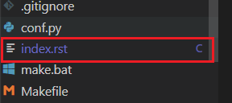
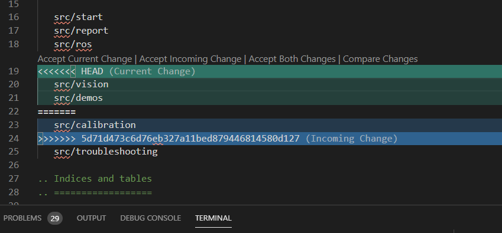

Navigation Stack
================ 

This inspired by :

- http://wiki.ros.org/navigation/Tutorials/RobotSetup

- https://hagenmek.gitlab.io/mas514/src/start.html

- https://automaticaddison.com/how-to-set-up-the-ros-navigation-stack-on-a-robot/

As start we assumed that you have mas514 package in your catkin work space if not please refer to the following link :https://hagenmek.gitlab.io/mas514/src/start.html.

The ROS Navigation Stack is a collection of software packages that you can use to help your robot move from a **starting location to a goal location** safely.
In order to build the Navigation stack you have to build and set up several packages, as in the figure bellow, The white components are required components that are already implemented in Ros, the gray components are optional components that are already implemented, and the blue components must be created for each robot platform. 

.. figure:: ../figs/Navigation_Stack.JPG
    :width: 500px
    :align: center

    Navigation Stack

Now, let us build the navigation stack for Jetbot step by step. 

    - First, open your Jetbot terminal  and navigate to your workspace create the first package for navigation, for me it’s called jetbot_nav, then build it

.. code-block::

        cd ~/catkin_ws/src
        catkin_create_pkg jetbot_nav rospy roscpp std_msgs tf tf2_ros geometry_msgs sensor_msgs move_base
        cd ~/catkin_ws/
        catkin_make --only-pkg-with-deps jetbot_nav

    - Now we’re going to put together our launch file. Open a new terminal window, and move to your jetbot_nav package.

    .. code-block::

        roscd jetbot_nav
        mkdir launch
        cd launch

    - Create your launch file. Mine called jetbot.launch.

    .. code-block::

        gedit jetbot.launch

    -  Add the following code:

    .. code-block::

        <launch>
        </launch>

Troubleshooting
-----------------

Can't Connect to Jetbot using SSH
---------------------------------
If the connection is not working, check the following steps:

- Is the private SSH key located in your :code:`.ssh` folder?
- Are the SSH config using the correct IP address?
- Can you log in using Putty?
- If you can log in using Putty, try to execute :code:`sudo rm -rd ~/.vscode-server` and then try to log in using VS Code again.

Resolve Git Merge Conflicts
---------------------------
A merge conflict occurs when two files are merged and Git is not able to automatically merge the two files and their content. In these cases, we have to take action and resolve the conflicts manually. A merge conflict is indicated using a mark :code:`c` in VS Code's file tree as it is indicated inside the red box.

To resolve the merge conflicts, the files marked with a :code:`c` is simply opened and the conflict is presented in a nice manner in VS Code.

Here we can easily choose which of the conflicted versions we want. Either we choose to accept the "Current Change", "Incoming Change" or "Both Changes". Where the green and blue highlighted text represents the "Current Change" and the "Incoming Change" respectively. Please note that a file might have several conflicts and hence all these are highlighted as depicted above. Scroll trough the document and resolve all conflicts before saving the file. After all the conflicted files are resolved, the changes are ready to be staged/added and then committed. Finally back on track!

