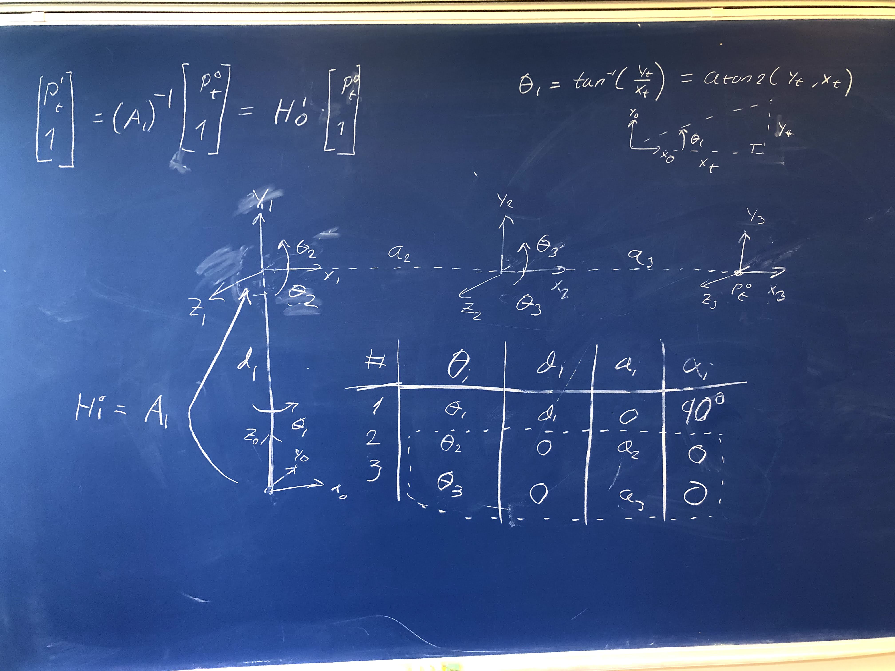

###############
Classroom Demos
###############

*************************
Lecture 4: ROS and Python
*************************

Synchronous Publisher
=====================

.. code-block:: python

    #!/usr/bin/env python
    """
    DemoPublisher Lecture 4

    Try to echo node topic counter by executing:
    rostopic echo counter
    """

    # Import needed libraries
    import rospy
    from std_msgs.msg import Int32

    # Main function
    if __name__ == '__main__':
        #!/usr/bin/env python
    """
    DemoSyncPublisher

    Try to echo node topic counter by executing:
    rostopic echo counter
    """

    # Import needed libraries
    import rospy
    from std_msgs.msg import Int32

    # Main function
    if __name__ == '__main__':
        try:
            # Initialize node
            rospy.init_node('demoPublisher')

            # Publisher
            pub = rospy.Publisher('counter', Int32, queue_size=1)

            # Counter variable
            counter = 0

            # Create a while loop at 1s
            rate = rospy.Rate(1)
            while not rospy.is_shutdown():
                # counter += 1
                counter = counter + 1

                # Publish counter to ROS message
                pub.publish(counter)

                # Sleep remaining time
                rate.sleep()

        except rospy.ROSInterruptException:
            pass

Asynchronous Subscriber
=======================

.. code-block:: python

    #!/usr/bin/env python
    """
    DemoAsyncSubscriber
    """

    # Import needed libraries
    import rospy
    from std_msgs.msg import Int32

    # Main function
    if __name__ == '__main__':
        try:
            # Initialize node
            rospy.init_node('demoSubscriber')

            # Create callaback to handle data from subscriber
            def callback(msg):
                if msg.data:
                    print('Recieved counter=' + str(msg.data))

            # Subscriber
            rospy.Subscriber('counter', Int32, callback)

            # Keep node alive
            rospy.spin()
            
        except rospy.ROSInterruptException:
            pass

Asynchronous Subscriber
=======================

.. code-block:: python

    #!/usr/bin/env python
    """
    DemoAsyncClassSubscriber
    """

    # Import needed libraries
    import rospy
    from std_msgs.msg import Int32

    # Create ClassDef here
    class MyRosSubscriber(object):
        def __init__(self, gain, name):
            self.gain = gain
            self.name = name

        def callback(self, msg):
            print(self.name + ': counter*self.gain = ' + str(msg.data*self.gain))

    # Main function
    if __name__ == '__main__':
        try:
            # Initialize node
            rospy.init_node('demoClassSubscriber')

            # Create class instance
            myRosSubscriber1 = MyRosSubscriber(2, 'class1')
            myRosSubscriber2 = MyRosSubscriber(4, 'class2')
            
            # Subscribers
            rospy.Subscriber('counter', Int32, myRosSubscriber1.callback)
            rospy.Subscriber('counter', Int32, myRosSubscriber2.callback)

            # Keep node alive
            rospy.spin()
            
        except rospy.ROSInterruptException:
            pass

Python Class
============

.. code-block:: python

    # Imports Numpy package as np for easier usage later e.g. np.sin(1)
    import numpy as np

    # Class definition for MyClass
    class MyClass(object):
        def __init__(self, a, b=3):
            # Init is called when class instance is created
            print('Hi, MyClass was created!')

            # Copy input arguments to self which is the class object
            self.a = a
            self.b = b

        def print_a_and_b(self):
            # Print a and b
            print('a=' + str(self.a) + ' b=' + str(self.b))

        def __del__(self):
            # This function is called when the class is deleted
            print('I was deleted')

    # Demo usage of MyClass
    if __name__ == '__main__':
        # Creates class instance with a and b given
        myClass1 = MyClass(30, 40)

        # Creates class instance with only a given
        myClass2 = MyClass(-4)

        # Print a and b
        myClass1.print_a_and_b()
        myClass2.print_a_and_b()
        
        # Print class variables a and b for myClass1 instance of MyClass
        print(myClass1.a)
        print(myClass1.b)

*****************
Lecture 5: Elbow Manipulator
*****************

    Elbow manipulator with three revolute joints.

Python Implementation
=====================

.. code-block:: python
    :linenos:

    from src import math3d
    import numpy as np

    # Static DH Parameters
    d1 = 2
    a2 = 1.5
    a3 = 1.5

    # Define forward kinematics
    def forward(q, d1, a2, a3):
        # DH Transformations
        T01 = math3d.DH(q[0], d1, 0, np.pi/2)
        T12 = math3d.DH(q[1], 0, a2, 0)
        T23 = math3d.DH(q[2], 0, a3, 0)

        # Trasnform from coordinate {0} -> {3}
        T03 = T01.dot(T12).dot(T23) # or T03 = T01@T12@T23 not T03 = T01*T12*T23

        # Return result p = [x, y, z]
        return T03[0:3,3]

    # Two-Link solution
    def two_link(x, y, a1, a2, conf):
        D = (x**2 + y**2 - a1**2 - a2**2)/(2*a1*a2)

        theta2 = np.arctan2(conf*np.sqrt(1-D**2), D)
        theta1 = np.arctan2(y, x) - np.arctan2(a2*np.sin(theta2), a1 + a2*np.cos(theta2))

        return (theta1, theta2)

    # Define inverse kinematics
    def inverse(p, d1, a2, a3, conf):
        # Create zero array of size 3
        q = np.zeros(3)
        
        # Solve first angle
        q[0] = np.arctan2(p[1], p[0])

        # Calculate T01
        T01 = math3d.DH(q[0], d1, 0, np.pi/2)

        # Convert p to homogenour point in {0}
        P0 = np.ones(4)
        P0[0:3] = p

        # Transform P0 from {0} to {1}
        P1 = math3d.inv(T01).dot(P0)

        # Solve two link problem
        x = P1[0]
        y = P1[1]
        q[1], q[2] = two_link(x, y, a2, a3, conf)
        
        return q

    # Test IK
    q1 = np.array([30, 20, -20])/180*np.pi
    p1 = forward(q1, d1, a2, a3)

    # Test FK
    q2 = inverse(p1, d1, a2, a3, -1)

    # Compare and check that q1=q2
    print(q1)
    print(q2)

