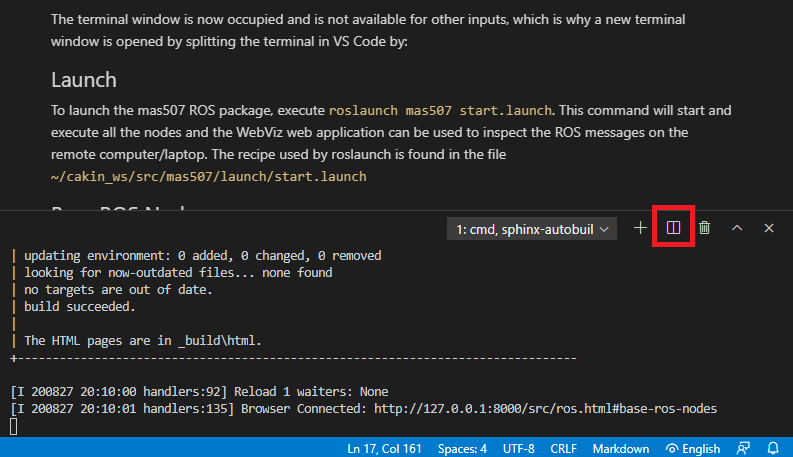
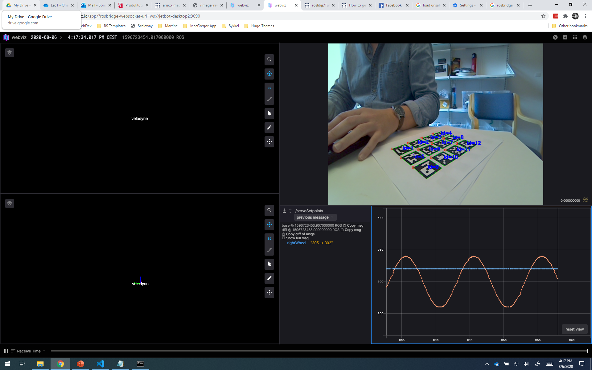
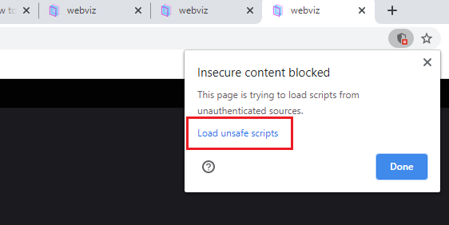

# ROS Package
## Install
All ROS packages contains a `CMakeLists.txt` and a `package.xml` which is the definition of the ROS package. These files are located in the `root` folder. The installation of  ros package is carried out by cloning this repository to the `~/catkin_ws/src/` directory by executing:
- `git clone https://gitlab.com/<your-gitlab-username>/mas507` inside the `~/catkin_ws/src/` folder.

This will create a folder named `mas507` and hence the source files are now available for the ROS environment to be installed as:
- `cd ~/catkin_ws`
- `catkin_make`

The `catkin_make` command will build all the dependencies and convert source code to binary code if needed e.g. for C/C++ code. After that the source ROS package is installed, the ROS package `mas507` is now ready to be launched.

## Start ROS Core
Before launching the ROS package we just installed, the ROS core has to be running on our Jetbot. To start the ROS Core, executer the following command in your terminal:
- `roscore`

The terminal window is now occupied and is not available for other inputs, which is why a new terminal window is opened by splitting the terminal in VS Code by clicking the button marked with a red square.

## Launch
To launch the mas507 ROS package, execute `roslaunch mas507 start.launch`. This command will start and execute all the nodes and the WebViz web application can be used to inspect the ROS messages on the remote computer/laptop. The recipe used by roslaunch is found in the file `~/cakin_ws/src/mas507/launch/start.launch`.

IMPORTANT! For ROS to allow for launching the ROS Nodes found in `~/cakin_ws/src/mas507/src` folder, they have to be allowed to be executable for the `jetbot` user. Enable all Python source files to be executable by:
- `cd ~/cakin_ws/src/mas507/src`
- `sudo chmod +x *.py`

## Base ROS Nodes
The ROS package is packed with four ROS nodes which is aimed at creating a starting point for the student development. The first node `JetbotController` is used to control the servo motors connected to the Adafruit controller. The `JetbotCamera` node captures and calibrates the images fetched from the Jetbot camera. The `ImageSaver` node is used to save images which again will be used to calibrate the camera. Finally, the `MainController` node is where the students will actually implement their control strategy.

### JetbotController
The JetbotController node is used to control the two wheels and the servos actuating the robot arm developed in this course. The node subscribes to the ROS message defined in `ServoSetpoints.msg` and writes them to the Adafruit servo controller.

### JetbotCamera
Inspect the different images published by the node by opening the WebViz application.

### ImageSaver
This node is set up to listen the `/image_raw` topic published at a fixed rate by the JetbotCamera node. Images can be saved by executing the following command: `rostopic pub saveImage std_msgs/Bool 1`. This ensures that the current view is saved to the `mas507/images` folder.

### MainController
This node is supposed to be used to implement the control algorithm developed by the student groups. Look at the other nodes to get an idea on how this node can be developed further.

## WebViz for ROS

Since ROS is only running the black terminal, it is hard to se what's going on under the hood. After that the the ROS package has been launched, the WebViz application is a handy web application to inspect the various topics and activities on your Jetbot. Log into your Jetbot after that you have launched the MAS507 package by opening `https://webviz.io/app/?rosbridge-websocket-url=ws://jetbot-desktop<group-number>:9090` e.g `https://webviz.io/app/?rosbridge-websocket-url=ws://jetbot-desktop2:9090` for Jetbot number 2. Please experiment with the various features provided by the WebViz web application.

NOTE: To make WebViz work, ensure that the feature for loading insecure pages is allowed e.g. in Chrome:

