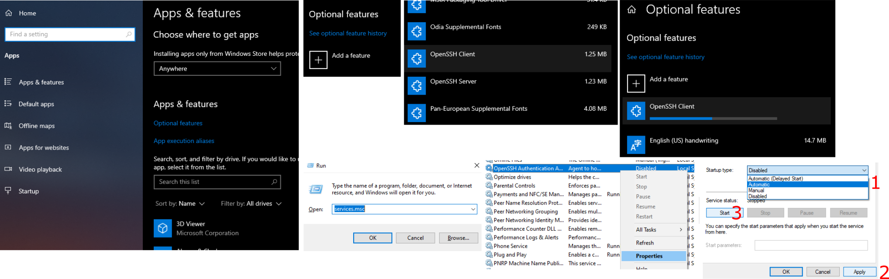
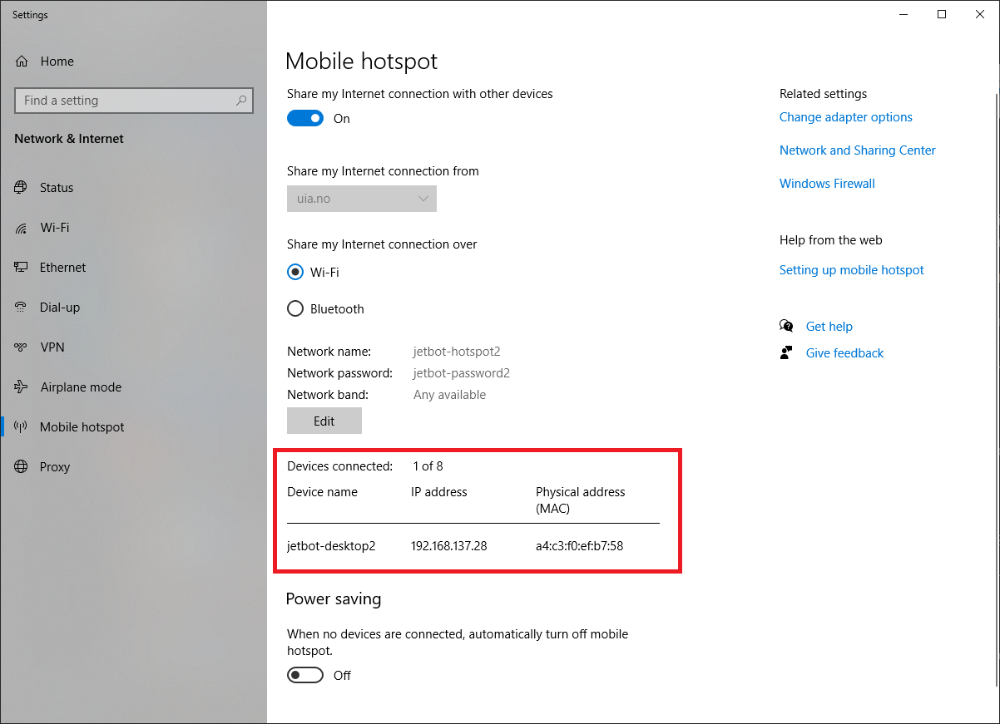
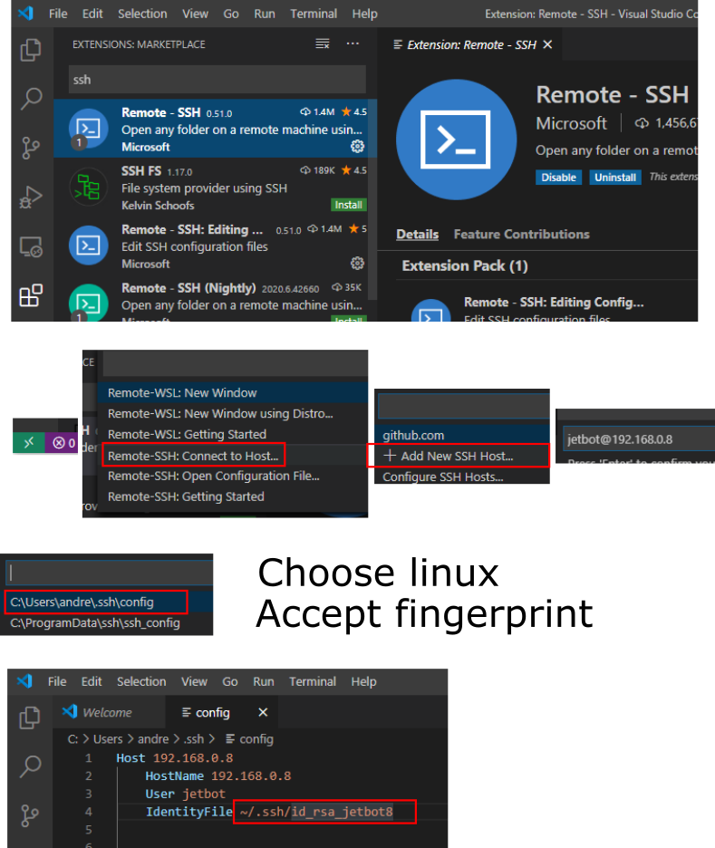

# Getting Started
This repository contains software and code examples for the Jetbot hardware which is supposed to be used in the MAS514 course.

The documentation will sometimes refer to your group number (`<group-number>`, Jetbot number). This text is then supposed to be replaced with your group number or more precisely, your jetbot id.

All Jetbots have the same login credentials which is:
- Username: `jetbot`
- Password: `jetbot`

## Client communication
The Linux operating system on the Jetbot can be used and operated using only the terminal (text input and output).
You can update system files, edit files directly in terminal, and run code, all from the mighty terminal in Linux.

SSH is an abbreviation for "Secure SHell" and allows for opening such a terminal session on a remote host.
This means you can use a Windows computer to operate a Linux system using text input.

Microsoft Visual Studio Code (VSCode) is a general source-code editor with the ability to edit code on remote Linux servers over an SSH connection.
This editor is fast, lightweight and has good color-coding for Python code. 
You can also open SSH terminals inside VSCode. 

## Enable OpenSSH Client Feature in Windows 10
Windows 10 does not have good SSH capabilities by default.
To enable some recommended features, an optional OpenSSH client needs to be installed in Windows 10:
- Be logged in as an administrator
- Navigate to Windows settings -> Apps
  - Click `Optional Features` at the top of the list
  - Add optional features
  - Find `OpenSSH Client` and install
- Click [WIN + R] to open run command
  - `services.msc`
  - Find `OpenSSH Authentication Agent` in the list 
    - Open properties and set it to automatically start
    - Click `apply` and `start` 

## Share Windows Wi-Fi
The Jetbot will get internet from a Windows computer by sharing over WiFi. 
This is possible on most modern Windows 10 computers.

- Open `Network and Internet` in Settings, and enter `Mobile hotspot`
- Set the hotspot to share Wi-Fi over Wi-Fi
- Click Edit and set this hotspot name and password:
  - Hotspot name: `jetbot-hotspot<group-number>`
  - Password: `jetbot-password<group-number>`
- Click to share connection
- The jetbot is already set up to look for this hotspot name and will connect automatically after some time
- When the connection is established, it can bee seen in the Mobile Hotspot list of connected devices: 
- The jetbot should now have internet connectivity which is needed for our setup

## Visual Studio Code Remote Developement
[Download](https://aka.ms/win32-x64-user-stable) and install VSCode. 
Default installation is alright. 

Open VSCode and Install Remote SSH extension
- Click extensions button on the left side
- Search for and install `Remote - SSH`.
- Restart VSCode if prompted to do so.
- Get the `id_rsa_jetbot<group-number>` file from the teacher and put it under `C:\Users\%USERNAME%\.ssh`.
  - This is a private SSH key used to connect to a remote system (like the jetbot) without having to type in a password. 
  - This file must reside on the client windows computer.
  - The public part, i.e. `id_rsa_jetbot<group-number>.pub` is already put on the jetbot during installation
- Click the green icon in the lower-left corner of VSCode to enter remote session.
  - Choose `Remote-SSH: Connect to host`
  - Add a new SSH host
  - Type in `username@hostname` or `username@ip-adress` such as `jetbot@jetbot-desktop8` or `jetbot@192.168.0.8` if your group number is 8
  - Choose to edit the configuration file under `C:\Users\%USERNAME%\.ssh\config`
    - Under `Host 192.168.0.8`, add the information `IdentityFile ~/.ssh/id_rsa_jetbot<group-number>` (See image below)
- Click the green icon again and choose `Remote-SSH: Connect to host`
  - Now the item `192.168.0.<group-number>` or `jetbot-desktop<group-number>` should be there.
  - Click this, select "Linux" as the remote platform, then VS Code should start initialization and setting up the SSH Host.

Inside VSCode you can open a folder using the bar on the left side.
A terminal window can be opened with maybe `[CTRL + J]` depending on system. 
Check the keyboard shortcut preferences for `Toggle integrated terminal`.

## Safe shutdown of Jetbot
To avoid corrupting files, you should shut down the Jetbot through the terminal.
If there is power loss while the system is running, important system files may get corrupted.
It should be noted that that SD card is not encrypted, and it should be possible to extract user files even if the Ubuntu OS won't boot anymore.

The Jetbot has to be shut down by entering a terminal command in VSCode.
- Enter this command in VSCode SSH session
  - `sudo shutdown now`
- Enter the password when prompted.

<!-- ## Optional: X Forwarding
This section explains the necessary steps to forward X to your remote computer. This example is meant for Windows, but should also work the same for a Linux based OS. Forwarding X, means that we can use the Matplotlib library and se the resulting plot on our remote computer. It also work with most other GUI applications running on the host computer (Jetson Nano). To enable X forwarding, the following steps are required for the host and the remote computer.

### Host Computer Setup (Jetson Nano)
Log in to the remote computer using SSH as before and carry out the following steps.

### Remote Computer Setup (Your Computer) -->

