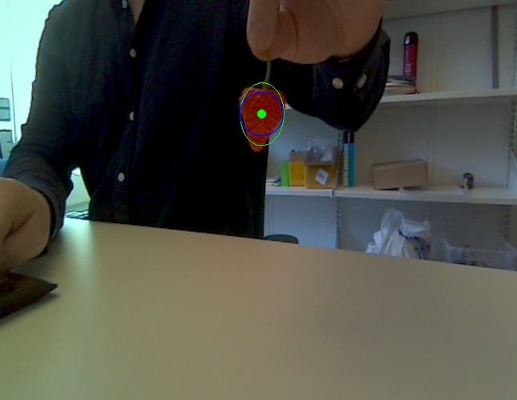

####################
Strawberry Detection 
####################

    Strawberry detection using OpenCV and PnP algorithm

This section describes a simple method for detecting the position of the strawberry relative to the camera, meaning the x, y , and z position. To do so, a strawberry detection class is made available in the GitLab repo under :code:`./src/StrawberryDetector.py`. This class was inspired by the GitHub repo found at: https://github.com/andridns/cv-strawberry

The Strawberry detection is carried out in two major steps. The first step apply color segmentation to isolate the strawberry from the remaining image, and the second part calculates the strawberry location using the well known `PnP algorithm <https://en.wikipedia.org/wiki/Perspective-n-Point>`_. A major drawback using this method is that the main diameter/width of the strawberry has to be measured physically. The :code:`MainController.py` node also include an example on how the strawberry detection class is integrated with the rest of the control system.
