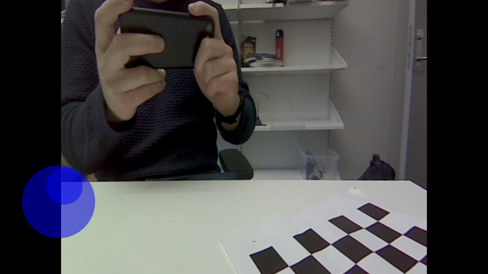

####################
Flask Web Controller
####################

    Screenshot from the Flask web application used to control the Jetbot

This guide will explain the required steps to install the web controller feature which enables the Jetbot to be controlled from any smartphone or tablet using the touch screen. Two virtual joysticks are used as control inputs and the camera video stream is streamed to the web application background in real-time.

*******************************
Create WiFi Hotspot from Jetbot
*******************************

In order to achieve sufficient response when using the Web Controller from your smartphone or tablet, it is recommended to configure the Jetbot to host its own hotspot as a system service. The default hotspot service in Ubuntu currently does not allow to be hosted on the same wlan interface while the Jetbot is already connected to a WiFi network (which is the case for us where the Jetbot is connected to yout laptop WiFi hotspot). 

It is therefore needed to install some additional software named :code:`linux-wifi-hotspot`. The installation procedure and configuration of this software is described below.

#. Install Linux Hotspot software:

    - :code:`sudo apt install -y libgtk-3-dev build-essential cmake gcc g++ pkg-config make hostapd`
    - :code:`git clone https://github.com/lakinduakash/linux-wifi-hotspot`
    - :code:`cd linux-wifi-hotspot/src/scripts`
    - :code:`sudo make install`

#. Clean up after installation (optional):

    - :code:`cd ~`
    - :code:`sudo rm -rd linux-wifi-hotspot`

#. Create system service:

    - Open :code:`create_ap.conf` by :code:`sudo nano /etc/create_ap.conf` and change the following entries:

        .. code-block::

	        INTERNET_IFACE=wlan0
	        SSID=jetbot<group-number>
	        PASSPHRASE=jetbot<group-number>-pwd

    - Open/create the service file by executing :code:`sudo nano /etc/systemd/system/create_ap.service` and paste the following code into the nano editor and save:

        .. code-block::

            [Unit]
            Description=Create AP Service
            After=network.target

            [Service]
            Type=simple
            ExecStart=/usr/bin/create_ap --config /etc/create_ap.conf
            KillSignal=SIGINT
            Restart=on-failure
            RestartSec=5

            [Install]
            WantedBy=multi-user.target

#. Enable service to be automatically started after boot/startup:
    - :code:`sudo systemctl enable create_ap`

#. Start service
    - :code:`sudo systemctl start create_ap`

#. See status of system service
    - :code:`sudo systemctl status create_ap`

***********************
Install Web Application
***********************

The Flask Web Application is ready to use and hence is only needed to be added to the ROS launch file and :code:`WebController.py` file has to be moved from this repo to your own. Follow the steps to install and enable the Web Controller app in your project:

#. Install Flask:

    - :code:`pip install Flask`

#. Copy the two folders :code:`./src/static` and :code:`./src/templates` to your project in the same folder locations.

#. Copy :code:`WebController.py` to :code:`./src` and make the file executable by executing the following command :code:`sudo chmod +x WebController.py`

#. Copy the ROS message file :code:`WebJoystick.msg` found in :code:`./msg` to your project.

#. In order to make ROS being aware of the new ROS message, the message has to be added to the :code:`CMakeLists.txt` under the section :code:`add_message_files()`. The new ROS message :code:`WebJoystick.msg` are added as:

    .. code-block::

        add_message_files(
            FILES
            ServoSetpoints.msg
            WebJoystick.msg
        )

#. After adding the new ROS message, the :code:`cakin_make` has to be executed from the from :code:`~/catkin_ws` folder. This will build and register the new message.

#. Add the new node for our Flask Web Controller by adding the line :code:`<node name="WebController" pkg="mas507" type="WebController.py" output="screen"/>` to the :code:`start.launch` file.

#. Connect your smartphone or tablet to the new WiFi hotspot being hosted by the Jetbot.

#. Start the ROS package using :code:`roslaunch mas507 start.launch` and visit :code:`http://jetbot-desktop<group-number>:8000` on your smartphone or tablet. The video stream from the camera should now be streaming to the webpage background. Try to tap the screen to use the two joysticks on the left and right side of the screen.

******************************
Integrate with Main Controller
******************************

The two new ROS messages produced by the Flask web application node are now available using the ROS topics :code:`\webJoystickLeft` and :code:`webJoystickRight`. Please look at the :code:`MainController.py` to see how it can be integrated to move the robot. Be aware that the values might be tuned for your specific Jetbot. The implementation and usage of the Web Controller joysticks is also shown below.

.. literalinclude:: ../../src/MainController.py
    :language: python

