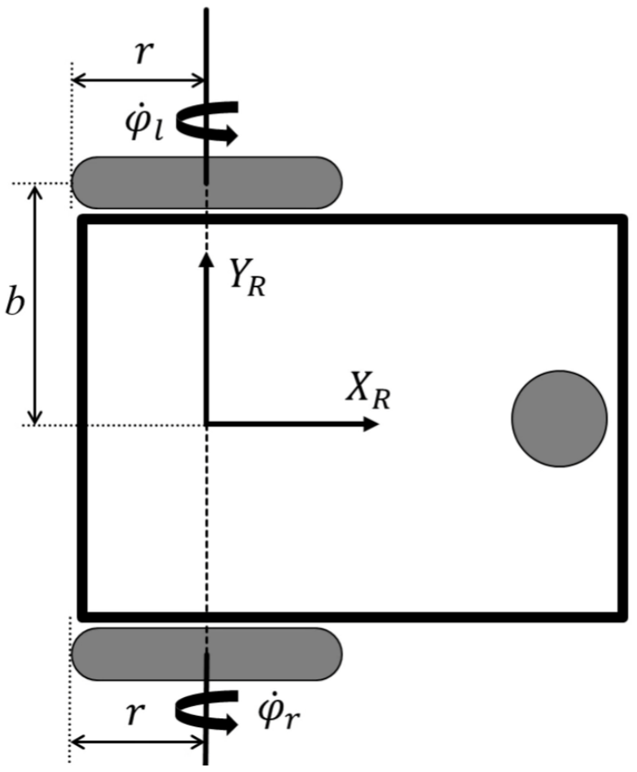
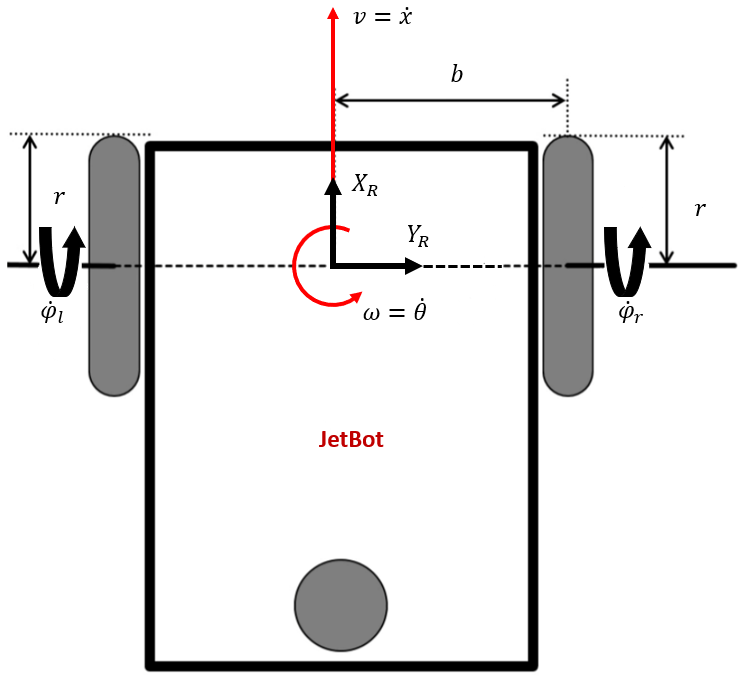
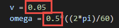
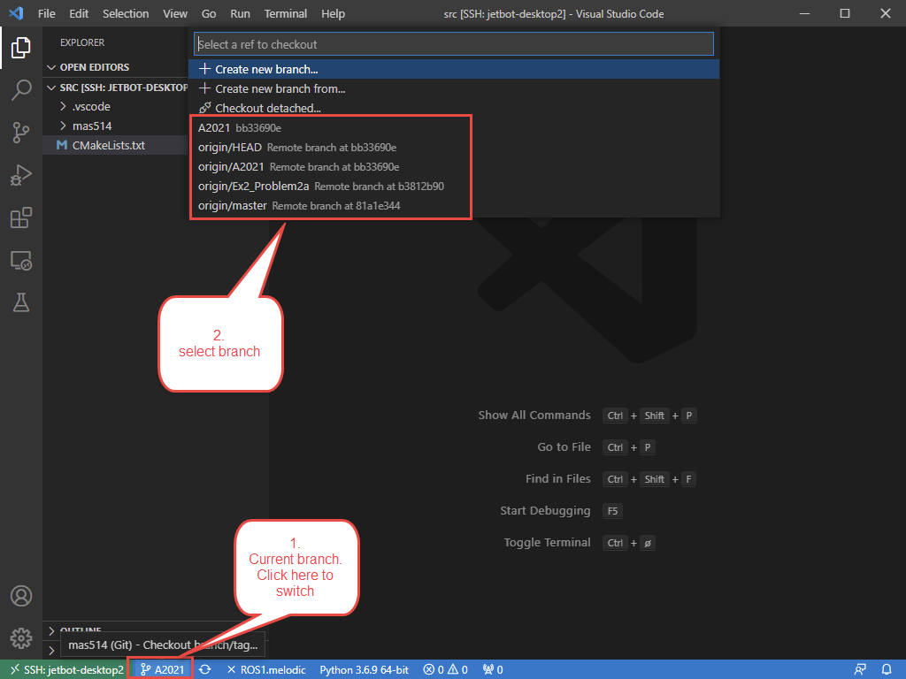
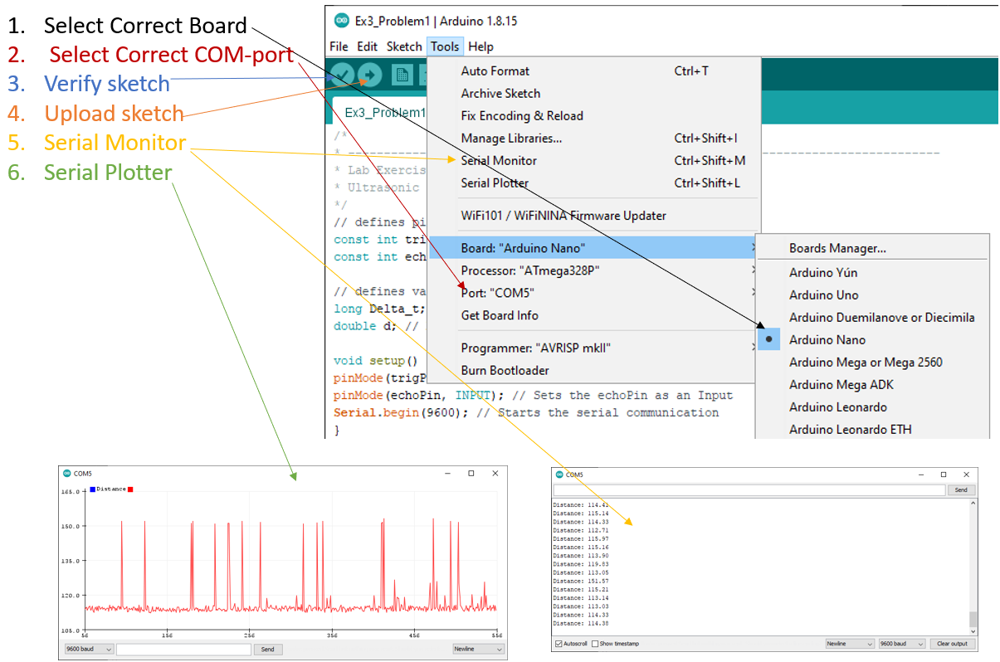
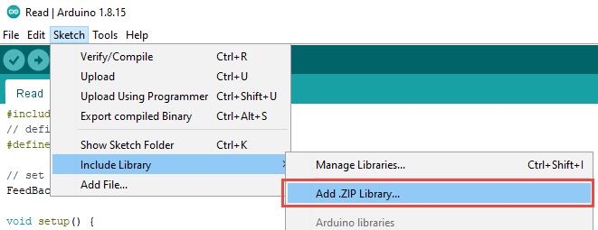
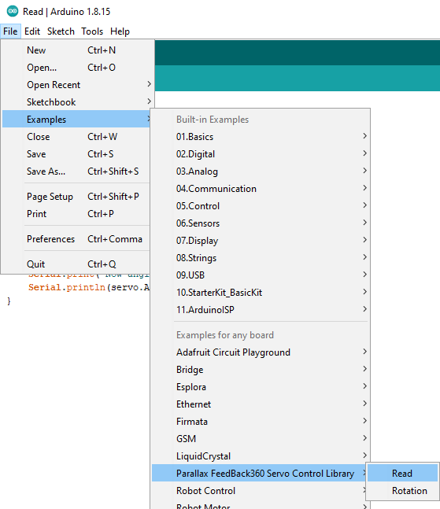
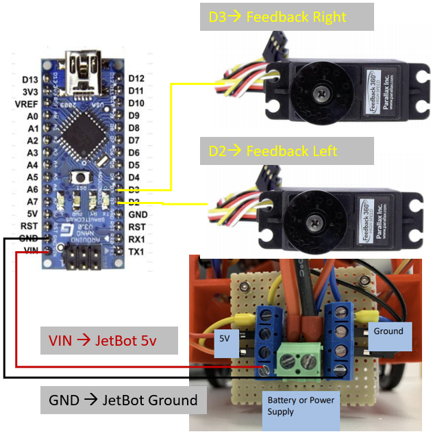
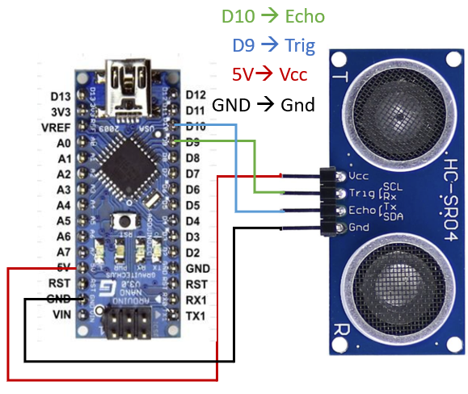

===================
Lab Exercise
===================

Exercise #2
===================

******************************
Problem 1
******************************

Derive the equation of motions for the differential drive robot showed in the figure below

* Two fixed standard wheels
* The robot frame (R) in between the wheels
* Stack the wheel equation for this configuration

Find (see Chapter 3.2, Autonomous Mobile Robots):
a. Forward differential kinematics
b. Inverse differential kinematics
c. Degree of maneuverability

Solution proposal: https://www.youtube.com/watch?v=tymqJPNjyU0&list=PL0m60CTll3OwWqpck32Z6Tzc8_0BxfYOH&index=12

------------------
1a - Solution
------------------

Forward differential kinematics

.. math::
    \begin{bmatrix}
    \dot{x}\\
    \dot{y}\\
    \dot{\theta}
    \end{bmatrix}
    =
    \begin{bmatrix}
    r/2 & r/2\\
    0 & 0\\
    r/2b & -r/2b
    \end{bmatrix}
    \begin{bmatrix}
    \dot{\varphi_r}\\
    \dot{\varphi_l}
    \end{bmatrix}

------------------
1b - Solution
------------------

Inverse differential kinematics

Solution

.. math::
    \begin{bmatrix}
    \dot{\varphi_r}\\
    \dot{\varphi_l}
    \end{bmatrix}
    =
    \begin{bmatrix}
    1/r & 0 & b/r\\
    1/r & 0 & -b/r
    \end{bmatrix}
    \begin{bmatrix}
    \dot{x}\\
    \dot{y}\\
    \dot{\theta}
    \end{bmatrix}

------------------
1c - Solution
------------------
Degree of Maneuverability

Solution

.. math::
    \delta_m = 2, \mspace{30mu} \delta_s = 0, \mspace{30mu} \delta_M = 2

******************************
Problem 2
******************************

Home (extra) Work: Kinematics and control of the JetBot

The goal of this exercise is to program and implement a closed-loop motion controller for a differential-drive robot.
For this, two subtasks have to be solved:

a. Given desired forward and angular velocities of the robot, one should compute the corresponding wheel velocities in
order to make the robot drive accordingly
b. Develop a controller that computes velocity commands to drive the robot to a specified target position (see Chapter
3.6, Autonomous Mobile Robots)

------------------
2a - Solution
------------------
Inverse Differential Kinematics

Solution

See MATLAB livescript solution proposal for problem 1abc in Canvas to see how the equations below are derived and
isolated

``https://uia.instructure.com/courses/9411/files/1528790/download?download_frd=1``

.. math::
    \dot{\varphi}_l = \frac{v + b \omega}{r} \\
    \dot{\varphi}_r = \frac{v - b \omega}{r}

Inverse Kinematics Control is implemented in a new node :code:`InverseKinematics.py` as shown below

.. literalinclude:: ../../src/InverseKinematics.py
    :language: python

Modify the following highlighted values to change the velocity in x direction [m/s] and the angular rotation arround
robot frames origo [rpm]

The old ros launch file :code:`start.launch` is modified as shown in the branch for Problem 2a. In the A2021 branch, the ned node is commented out as shown below:

.. literalinclude:: ../../launch/start.launch
    :language: xml

The new InverseKinematics node including the modified ``start.launch`` is updated in a new git branch
``https://gitlab.com/hagenmek/mas514/-/tree/Ex2_Problem2a`` while the original launch file is found in the A2021 branch.

It is also possible to switch between branches directly in VS code

If the new branch is not listed, try to delete the git folder and clone again
``git clone https://gitlab.com/hagenmek/mas514``

------------------
2b
------------------

First problem 3a must be carried out for reading wheel encoder position to estimate the robots pose.

Exercise #3
===================

******************************
Problem 1
******************************

Install Arduino IDE from Canvas (https://uia.instructure.com/courses/9411/files/folder/Arduino). Also available for Mac
and Linux (https://www.arduino.cc/en/software) If problem with USB drive not detecting the Arduino as a COM-port install
CDM212364_Setup.exe that is also available in Canvas.

It is also possible to program the Arduiono from VS code as described here: https://www.youtube.com/watch?v=VfLTZcKCGfk.
However, the serial-monitor did not work verry well for this exercise. So it is recomended to do 1c from the Arduino
IDE.

------------------
1a
------------------

Download the Parallax-FeedBack-360-Servo-Control-Library.zip file from Canvas and add it to the Arduino library as shown in the picture below

Open the Parallax Feedback 360 Servoe Read Example as shown below 

.. literalinclude:: ../../Arduino/Ex3_Problem1a.ino
    :language: c++

Connect the Arduiono Nano to the JetBot as shown in the figure below

------------------
1b
------------------

Upload the Read sketch to the Arduino and open serial-monitor.

.. literalinclude:: ../../Arduino/Ex3_Problem1b/Ex3_Problem1b.ino
    :language: c++  

Run the JetBot motors through ROS using the virtual JoyStick or similar.

The angular rotation should be continously updated for the motor connected to pin D2 (left motor) when driving the motor.

------------------
1c
------------------

Modify the code to read also the encoder for the second motor (right motor).

------------------
1c - Solution
------------------

I have added the whole code in one file, no need for library, .h or .cpp file.

.. literalinclude:: ../../Arduino/Ex3_Problem1c_Solution/Ex3_Problem1c_Solution.ino
    :language: c++   

Fore more details about the code take a look at the datesheet in Canvas: https://uia.instructure.com/courses/9411/files/folder/JetBot/Data%20sheets?preview=1524097

******************************
Problem 2
******************************

Ultrasonic Range Sensor

Measure the distance to an object using the HC-SR04

2a. Set-up the HC-SR04 according to the guide below (1a)

2b. Implement the missing equation in the provided sketch

2c. Monitor/plot the measured distance

------------------
2a
------------------

Connect the UltraSonic sensor to Nano as shown in picture below

------------------
2b
------------------

Implement the missing equation in the provided Arduino sketch :code:`Ex3_Problem1.ino` available in Canvas
(https://uia.instructure.com/courses/9411/files/folder/Arduino) and in Git as shown below: 

.. literalinclude:: ../../Arduino/Ex3_Problem2/Ex3_Problem2.ino
    :language: c++

------------------
2b Solution
------------------

.. literalinclude:: ../../Arduino/Ex3_Problem2_Solution/Ex3_Problem2_Solution.ino
    :language: c++    

Fore more details about the code take a look at this video: https://www.youtube.com/watch?v=ZejQOX69K5M&t=139s
------------------
2c
------------------

Monitor/plot the measured distance (can not be done at the same time).

******************************
Problem 3 - Extra / Home work
******************************

Intel RealSense L515 | LiDAR Camera (2D/3D)  

3a. Get to know the L515 LiDAR Camera. Take a look here: https://www.intelrealsense.com/lidar-camera-l515/

3b. Download Intel RealSense SDK 2.0 (Intel RealSense SDK 2.0) and play with the L515 LiDAR Camera

3c. Connect the L515 LiDAR Camera to the Jetson Nano and explor the ROS wrapper https://dev.intelrealsense.com/docs/ros-wrapper

 
